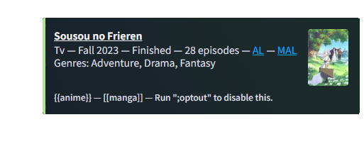

# Harmony
Harmony is a multipurpose bot that was created by me in **2020**. It has seen multiple iterations and rewrites over the years since then but this is probably the final one as the code is **considerably** better than it was then.

Harmony has a lot of different features, but there are definitely features that I'm more proud over like the **anime/manga** side of things.

### Some of the key features include:

* Anime and Manga search with the help of *AniList*.\
As well as partial OAuth2 integration and ability to view lists and other social data that is encompassed on the platform (eg. following people's statuses, your own ratings, etc. on the anime/manga that you're searching for.)

    * There is also a feature called *Inline Search* (Thanks [Leo](https://github.com/leocx1000)) which basically mimics some bots on anime subreddits:\
    For example you can use the syntax `{{anime}}` for anime and `[[manga]]` for manga to search for them respectively.\
    The bot will then respond with information about the thing(s) you searched for (supports multiple searches in the same message.):\
    \
    `{{frieren}}`\
    

* Your *standard* moderation commands such as `ban`, `unban`, `kick`, `purge`, etc.

* Various information commands such as `whois`, `icon`, `banner`, and `avatar`.

* Other miscellaneous / fun commands such as `urban` (Urban Dictionary), `raw`, `addemoji`, and more.

## Inviting
If you would like to invite my bot you can use the link below and start with `h;help` or by @mentioning the bot.\
***[Invite link](https://discord.com/oauth2/authorize?client_id=741592089342640198&scope=bot+applications.commands&permissions=10170482945222)***

## License
See [License](LICENSE)